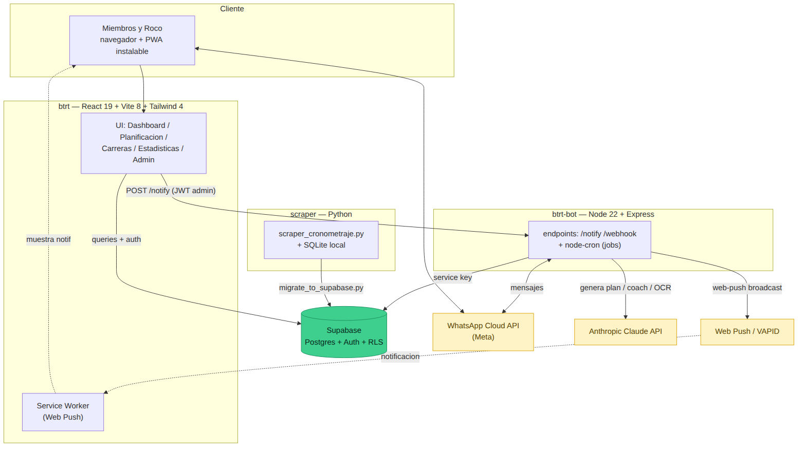
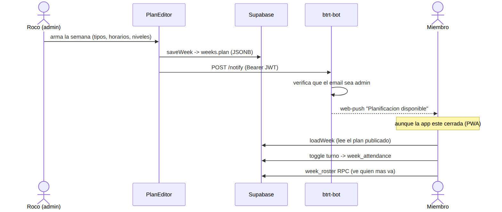
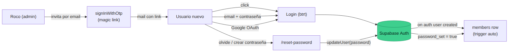

# Bandurrias TRT — Stack & Arquitectura

App del equipo Bandurrias Trail Running (Bariloche): planificación semanal,
asistencia a turnos, resultados de carreras y panel de admin para Roco.

Son **3 servicios** + Supabase como backend de datos/auth.

---

## Arquitectura general



| Servicio | Carpeta | Tecnología | Hosting |
|----------|---------|-----------|---------|
| **Frontend** | `btrt/` | React 19 · Vite 8 · Tailwind 4 · PWA | Railway / Vercel |
| **Bot** | `btrt-bot/` | Node 22 · Express | Railway |
| **Scraper** | `scraper/` | Python · SQLite | corre on-demand / cron |
| **Datos + Auth** | — | Supabase (Postgres + Auth + RLS) | Supabase Cloud |

---

## Frontend — `btrt/`

- **React 19** + **Vite 8** + **Tailwind 4** (`@theme`, `@tailwindcss/vite`)
- **react-router-dom 7** — routing
- **@supabase/supabase-js** — auth + queries (con la anon key + RLS)
- **recharts** — gráficos de Estadísticas
- **lucide-react** — íconos
- **PWA**: service worker propio (`public/sw.js`) + **Web Push (VAPID)**
- Fuentes: Inter (UI) + Barlow / Barlow Condensed (formato de plan de Roco)
- Dev/test: **vitest** + **eslint**

Páginas: Dashboard · Planificación · Carreras Anteriores (Buscar + Estadísticas) · Admin.

## Bot — `btrt-bot/`

- **Node 22** (ESM) + **Express**
- **@anthropic-ai/sdk** → **Claude API**: genera planes, coach bot, lee montos de comprobantes (OCR)
- **@supabase/supabase-js** — con la **service key** (bypassa RLS)
- **node-cron** — jobs / recordatorios
- **web-push** — envía las notificaciones push
- **WhatsApp Cloud API** (Meta Graph API, vía `fetch` en `wa.js`)
- Endpoints: `/webhook` (WhatsApp), `/notify` (push, protegido por JWT admin), `/health`

## Scraper — `scraper/` (Python)

- `scraper_cronometraje.py` — scrapea resultados de Cronometraje Instantáneo
- **SQLite** local (`cronometraje.db`) como staging
- `migrate_to_supabase.py` — sube resultados a la tabla `resultados` en Supabase
- `api.py` — API local (el `localhost:3001/search` que usa el front en dev)

---

## Supabase (backend)

- **Postgres** — tablas: `members`, `weeks` (plan JSONB), `sessions` (legacy),
  `payments`, `resultados`, `eventos`, `week_attendance`, `push_subscriptions`
- **Auth** — email+contraseña · magic link (OTP) · Google OAuth
- **RLS** (Row Level Security) — lectura pública de lo publicado, escritura solo admin
- **RPC** `week_roster(week_id)` — quién va a cada turno (expone solo el nombre)
- **Trigger** `on_auth_user_created` — crea fila en `members` al registrarse
- Migraciones versionadas en `btrt/supabase/migrations/` (`APPLY_ALL.sql` = todo junto)

> No usamos Realtime de Supabase (por eso el bot necesita Node 22 con WebSocket nativo).

---

## Flujo: publicar planificación + push



1. Roco arma la semana en el **PlanEditor** (tipos, horarios, niveles).
2. `saveWeek` guarda todo el plan como **JSONB** en `weeks.plan`.
3. El front pega `POST /notify` con el JWT del admin; el bot verifica que sea admin.
4. El bot manda **web-push** a todos los dispositivos suscriptos (llega con la app cerrada).
5. Los miembros leen el plan, se anotan a un turno (`week_attendance`) y ven quién más va (`week_roster`).

## Flujo: autenticación / alta de usuarios



- Roco invita por email → **magic link** (`signInWithOtp`).
- El usuario también puede entrar con email+contraseña o Google.
- Un **trigger** crea su fila en `members` automáticamente.
- "Crear / resetear contraseña" usa `updateUser` y marca `members.password_set`.

---

## Variables de entorno

### `btrt/.env.local` (frontend)
```
VITE_SUPABASE_URL=
VITE_SUPABASE_ANON_KEY=
VITE_ADMIN_EMAIL=email1@gmail.com,email2@gmail.com
VITE_VAPID_PUBLIC_KEY=          # push web (= la del bot)
VITE_PUSH_ENDPOINT=https://<bot>/notify   # opcional: auto-push al publicar
```

### `btrt-bot/.env` (bot)
```
SUPABASE_URL=
SUPABASE_SERVICE_KEY=           # secret key, NO la anon
WA_TOKEN= / WA_PHONE_ID= / VERIFY_TOKEN=   # WhatsApp Cloud API
ADMIN_WA_IDS= / ADMIN_EMAILS=
ANTHROPIC_API_KEY=
VAPID_PUBLIC_KEY= / VAPID_PRIVATE_KEY= / VAPID_SUBJECT=
PORT=3002
```

> La **VAPID private key** vive solo en el bot, nunca en el front ni en git.
> La **VAPID public** del bot tiene que ser igual a `VITE_VAPID_PUBLIC_KEY` del front.

---

## Setup / deploy rápido

```bash
# Frontend
cd btrt && npm install && npm run dev        # dev (localhost:5173)
npm run build && npm run preview             # build de prod

# Bot
cd btrt-bot && npm install && npm start      # Node 22+

# Migraciones: pegar btrt/supabase/migrations/APPLY_ALL.sql
# en Supabase Studio -> SQL Editor (idempotente)
```

Supabase → **Authentication → URL Configuration**: Site URL = dominio de prod
+ Redirect URLs (`/` y `/reset-password`).

---

## Regenerar los diagramas

```bash
cd btrt/docs
npx -y @mermaid-js/mermaid-cli -i architecture.mmd -o architecture.png -s 2 -b white
npx -y @mermaid-js/mermaid-cli -i publish-flow.mmd -o publish-flow.png -s 2 -b white
npx -y @mermaid-js/mermaid-cli -i auth-flow.mmd     -o auth-flow.png     -s 2 -b white
```
Las fuentes `.mmd` son editables (texto). Los `.png` son la salida.
